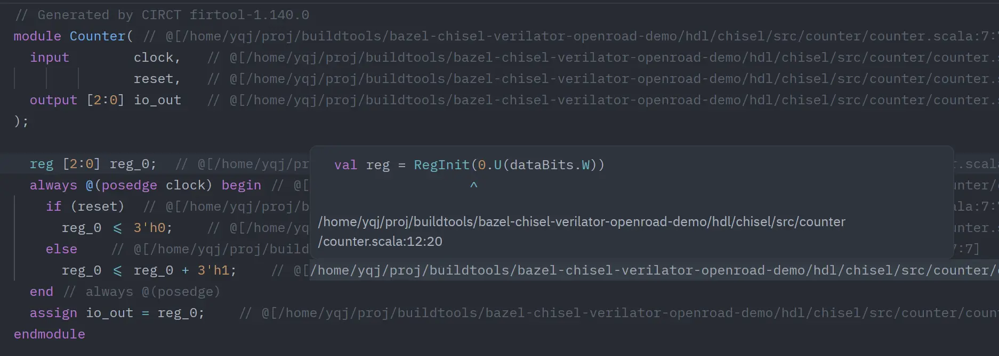
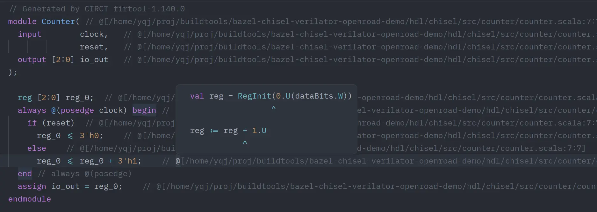

# firrtl-source-locator





A Zed companion LSP extension for Verilog/SystemVerilog that parses FIRRTL/Chisel source locator comments (`@[...]`) and jumps back to Scala source locations.

## Features

- `textDocument/definition`
  - Jump from anywhere inside one locator comment to all mapped Scala locations.
  - Always returns a multi-target list for one `@[...]` block (for picker-based selection in Zed).
  - Supports inherited-path tokens like `:108:21`.
  - Supports multi-column tokens like `:257:{27,31,48,72}`.
- `textDocument/hover`
  - On a locator token, shows a 3-line preview:
    1) mapped source code line
    2) `^` column indicator line
    3) expanded locator path (`path:line:col`)
  - On `// @[` (expanded trigger range), shows a summary of all mapped targets.
    - Each locator entry is rendered as 2 lines (source line + `^` line; multi-column entries share one `^` line).
  - Uses fenced Markdown code blocks with language tags (`scala` / `firrtl` / `verilog` / etc.) for syntax highlighting in hover.

Note: this extension intentionally prioritizes `Go to Definition` for locator blocks (instead of `DocumentLink`) so one click can always produce the multi-target picker.
It now returns `LocationLink` targets with explicit column ranges for each mapped source point.

## Build Strategy (Local Compilation Only)

This project intentionally uses **local compilation only** for the language server:

- No prebuilt binaries in `server/bin/<triplet>/`
- No runtime download from GitHub
- No CI packaging dependency

When Zed starts the language server, the extension does this:

1. Finds `cargo` and `rustc` from your worktree shell PATH.
2. Materializes bundled server source files into `<extension-workdir>/server-src/`:
   - `Cargo.toml`
   - `Cargo.lock`
   - `src/main.rs`
   - Optional override: set `FIRRTL_SOURCE_LOCATOR_SERVER_MANIFEST` to an absolute manifest path.
3. Verifies toolchain availability and version (`rustc >= 1.75.0`).
4. Runs:
   - `cargo check --manifest-path <resolved-manifest-path> --bin firrtl-source-locator-server`
5. If successful, starts:
   - `cargo run --manifest-path <resolved-manifest-path> --bin firrtl-source-locator-server`

To reduce cross-system drift, the repo includes `rust-toolchain.toml` (`stable`).

## Error Reporting and Troubleshooting

If local compilation fails, the extension reports a clear failure message via Zed language server status (including a short compiler error snippet and a suggested fix command).

Common fixes:

```bash
# install or update Rust toolchain
rustup update stable

# verify tools are available
cargo --version
rustc --version

# reproduce the extension build check manually
cargo check --manifest-path server/Cargo.toml --bin firrtl-source-locator-server
```

If dependency download fails, verify your network access to `crates.io`.
If the extension cannot write bundled source files, check filesystem permissions for the Zed extension work directory and/or set `FIRRTL_SOURCE_LOCATOR_SERVER_MANIFEST`.

## Development

```bash
# check extension wasm crate
cargo check

# run server parser tests
cargo test --manifest-path server/Cargo.toml
```

## Use in Zed

1. Open Zed Extensions.
2. Click `Install Dev Extension`.
3. Select this project directory.
4. Open `.sv`/`.v` files and use Go to Definition on `@[...]` tokens.
5. Hover:
   - on one token for single-target details,
   - on `// @[` for all-target summary.
